# 🏆 競賽與榮譽

[← 回到首頁](../README.md)

## 獲獎

| 時間 | 競賽 | 作品 | 名次 | 證明 |
|:---|:---|:---|:---:|:---:|
| 2025/11 | 第30屆 大專校院資訊應用服務創新競賽 · 資訊應用組 | 虛擬重機械考照測驗 | 🥇 **第一名** | [📄](certificates/2025-innoserve-ip-1st.jpg) |
| 2025/11 | 第30屆 大專校院資訊應用服務創新競賽 · 勞工保障及保險智慧服務組 | 虛擬重機械考照測驗 | 🥇 **第一名** | [📄](certificates/2025-innoserve-labor-1st.jpg) |
| 2025/11 | 第30屆 大專校院資訊應用服務創新競賽 · 友達智慧場域與 ESG 應用組 | 代訓練模型之群養寵物飲水照護系統 | 🥈 **第二名** | [📄](certificates/2025-innoserve-auo-2nd.jpg) |
| 2024/11 | 第29屆 大專校院資訊應用服務創新競賽 · 資訊應用組 | 智慧生活中的 AI 交互式虛擬角色設計與應用 | 🥉 **第三名** | [📄](certificates/2024-innoserve-3rd.jpg) |
| 2025/07 | 第25屆 旺宏金矽獎 半導體設計與應用大賽 · 應用組 | 仿生機器魚用於池釣訓練 | **優勝獎** | [📄](certificates/2025-macronix-honorable.jpg) |
| 2026/08 | 2026 教育部 跨域智慧晶片設計應用創新專題實作競賽 | — | 佳作 | [📄](certificates/2026-moe-soc-honorable.jpg) |
| 2025/11 | 第30屆 大專校院資訊應用服務創新競賽 · 資訊應用組 | 可以與人互動的仿生機器魚 | 佳作 | [📄](certificates/2025-innoserve-fish-honorable.jpg) |
| 2024/11 | 第29屆 大專校院資訊應用服務創新競賽 · 資訊應用組 | 智能排球教練：AI 即時發球姿勢檢測與學習系統 | 佳作 | [📄](certificates/2024-innoserve-honorable.jpg) |

## 入圍 / 參賽

| 時間 | 競賽 | 作品 / 團隊 | 證明 |
|:---|:---|:---|:---:|
| 2025/12 | 2025 行動通訊實務競賽 · 智慧數位應用 | 掘掘動心 | [📄](certificates/2025-mobile-comm.jpg) |
| 2025/11 | 2025 全國大專院校產學創新實作競賽 | AI VTuber 互動式系統 | [📄](certificates/2025-industry-academia.jpg) |
| 2024/10 | 2024 中華電信 5G 創新應用大賽 | 融合 AI 語音模型與 IoT 之虛擬助手 | [📄](certificates/2024-5g.jpg) |
| 2024/07 | 2024 智在家鄉 聯發科技數位社會創新競賽 | 挖到你心坎 | [📄](certificates/2024-mediatek.jpg) |
| 2025/04 | 第22屆 育秀盃創意獎 | — | [📄](certificates/2025-ys-award.jpg) |
| 2026/04 | 第23屆 育秀盃創意獎 | — | [📄](certificates/2026-ys-award.jpg) |
| 2022 | 2022 通訊大賽之子競賽 5G 領航創新應用競賽 | — | [📄](certificates/2022-5g-pilot.jpg) |

## 研究計畫與學業

| 時間 | 項目 | 證明 |
|:---|:---|:---:|
| 2026/07 – 2027/02 | **115 年度 國科會大專學生研究計畫**（學生主持人） 運用虛擬模擬技術建置挖土機操作考照系統並分析其訓練成效 計畫編號 115-2813-C-150-018-E · 指導教授 陳國益 | [📄](certificates/nstc-project.jpg) |
| 2024/02 | 資訊工程系 112 學年度第一學期 **書卷獎** | [📄](certificates/dean-list-112-1.jpg) |
| 112 學年度 | 微積分期中會考 **全年級第 7 名**（1,477 人參加） | — |
| 2025/07 | 日本高知工科大學 交流研習 | — |

---

## 📸 比賽現場

  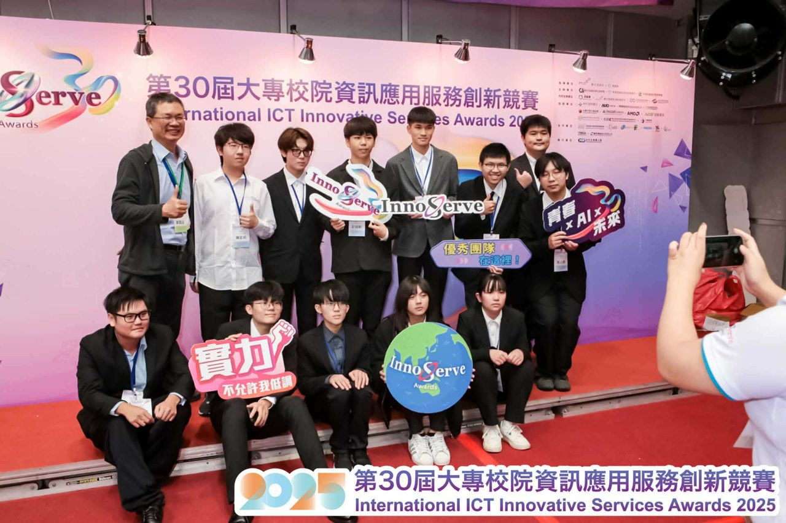
  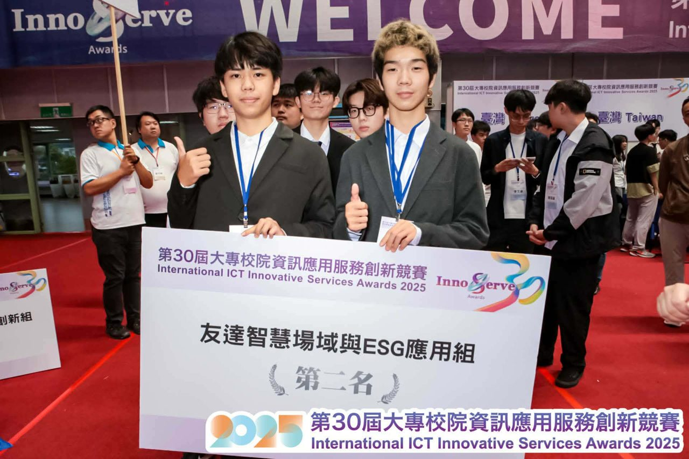

  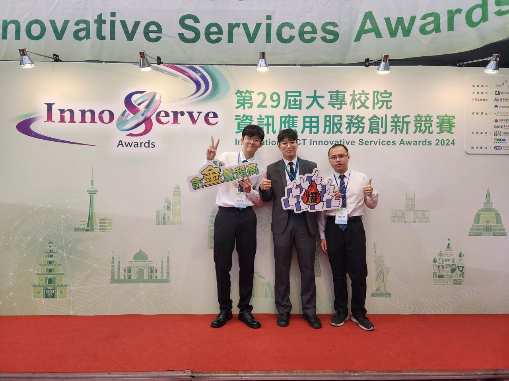
  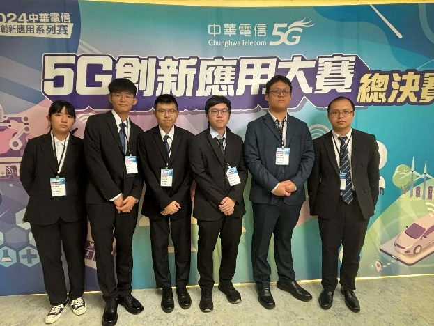

  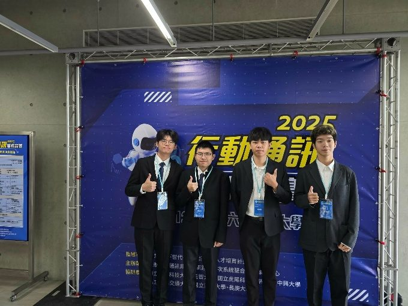
  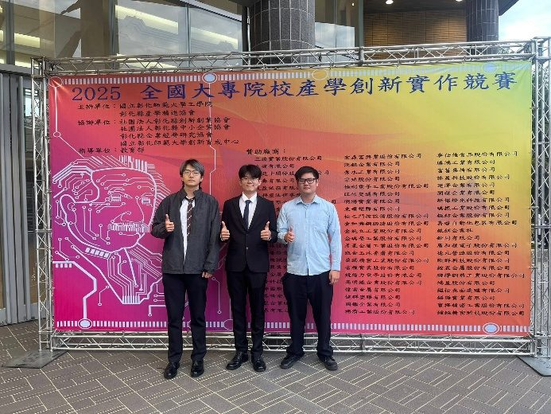

## 🖼️ 獎狀

  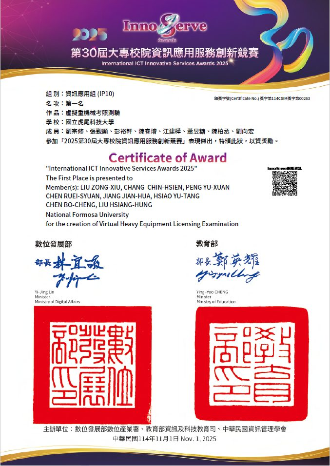
  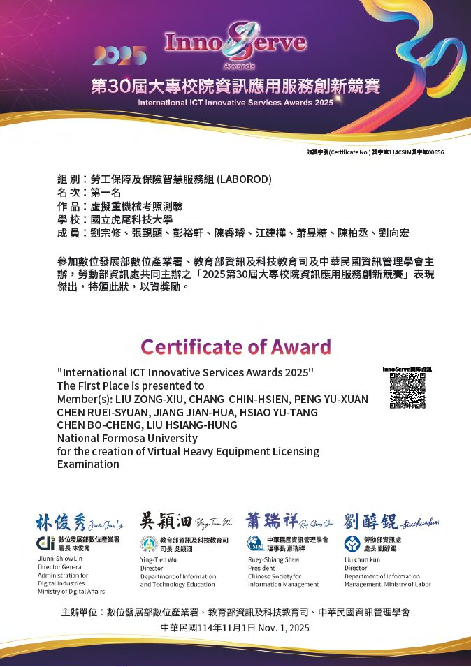
  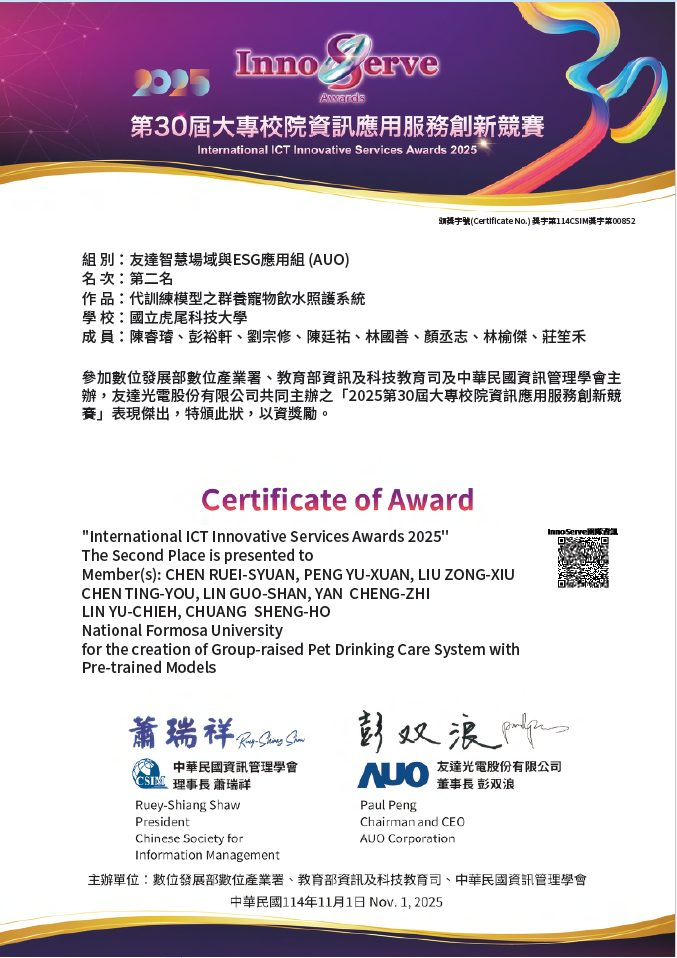
  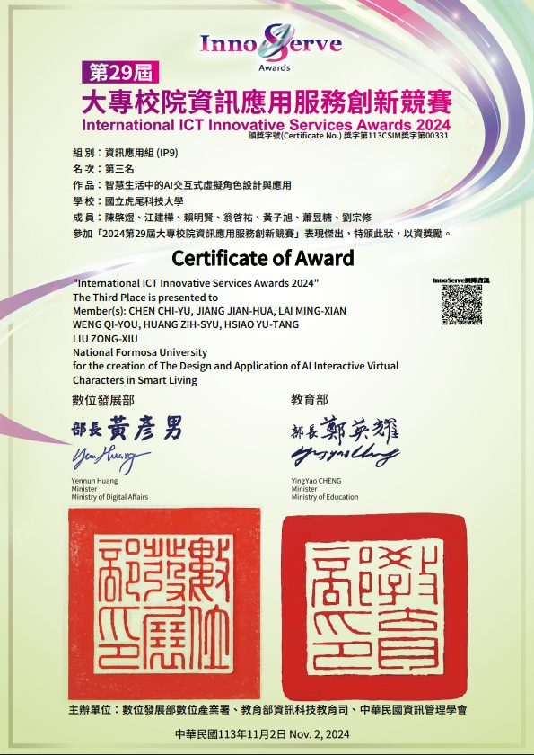

  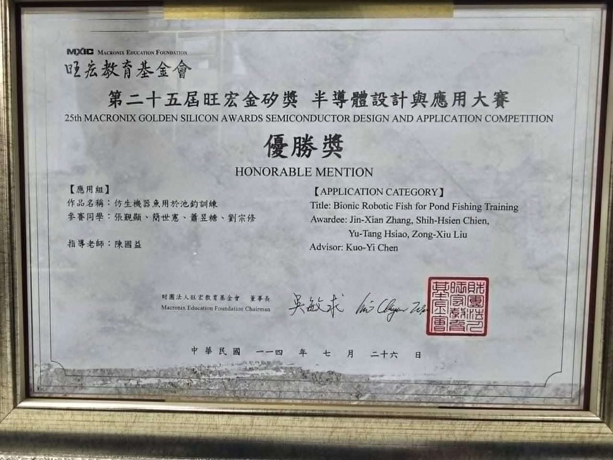
  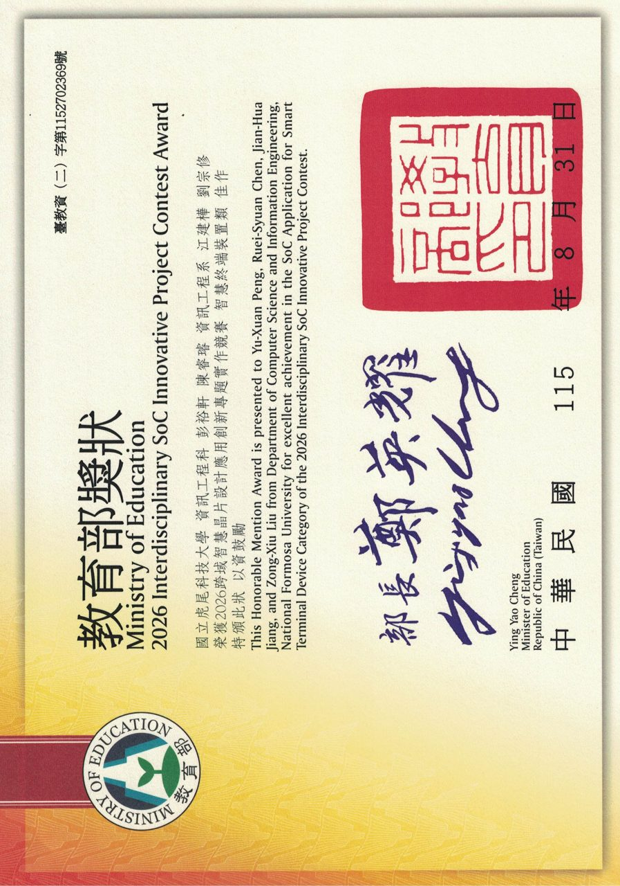

