# ① 虛擬重機械考照測驗
**Virtual Excavator Licensing Simulator**

> 國立虎尾科技大學 資訊工程系 · 行動運算與人機介面實驗室　|　2022/12 – 2023/12，後續延伸為 115 年度國科會大專學生研究計畫

[← 回到首頁](../../README.md)

  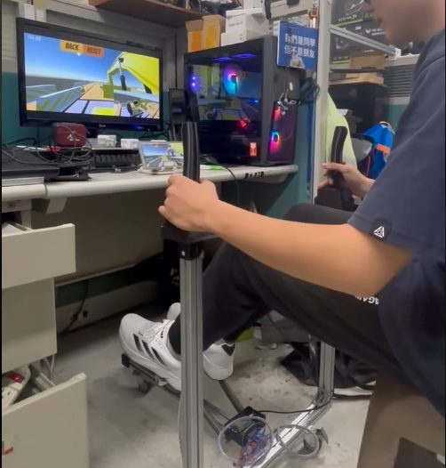
  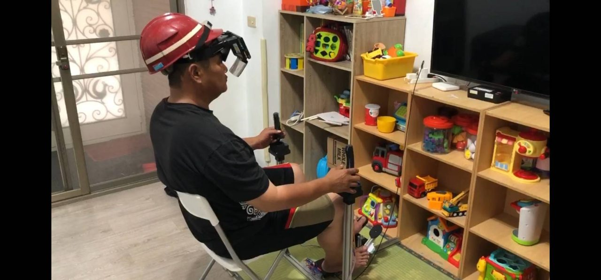

## 🏆 成果

| 成果 | 說明 |
|:---|:---|
| 🥇 2025 第30屆 大專校院資訊應用服務創新競賽 | **資訊應用組 第一名** |
| 🥇 2025 第30屆 大專校院資訊應用服務創新競賽 | **勞工保障及保險智慧服務組 第一名** |
| 🔬 115 年度 國科會大專學生研究計畫 | 運用虛擬模擬技術建置挖土機操作考照系統並分析其訓練成效（115-2813-C-150-018-E，2026/07 – 2027/02，學生主持人） |
| 📡 2025 行動通訊實務競賽 | 入圍（團隊「掘掘動心」） |
| 🏡 2024 智在家鄉 聯發科技數位社會創新競賽 | 入圍（團隊「挖到你心坎」） |

## 💡 動機

根據勞動部統計，挖掘機證照合格率從 **109 年的 81%** 一路降到 **112 年的 50%**。考生缺乏實機練習的場地與機具、補習費用高昂，初學者直接上實機又有工安風險。

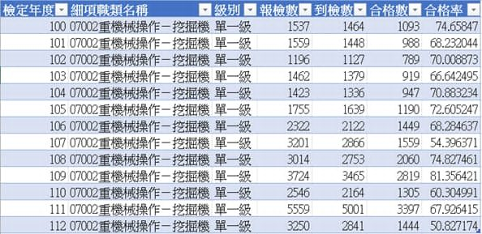

我們想做的是：**在室內就能反覆練習、又有臨場感的考照模擬器**，降低學習門檻，也吸引更多人投入營建機械領域。

## 🧩 系統架構

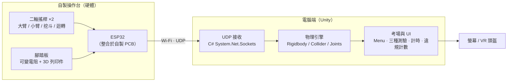

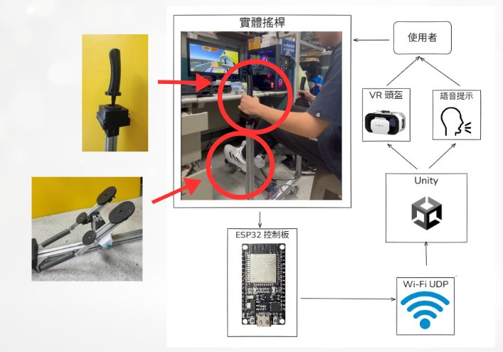

## 🔧 硬體設計

- **操作台框架**：以鋁擠型為主體，搭配 3D 列印的搖桿座連接件，可快速拆裝。
- **操控輸入**：二軸搖桿控制大臂、小臂、挖斗與迴轉；挖掘機的行走方式特殊，因此用 **可變電阻 + 自行繪製的 3D 列印件** 做出擬真腳踏板。
- **自製 PCB**：初期大量杜邦線導致接觸不良、訊號不穩，重新設計專屬 PCB 把 ESP32 直接整合上板並改用插拔式接頭，再用 SketchUp 設計外殼收納，大幅提升穩定度與耐用度。

  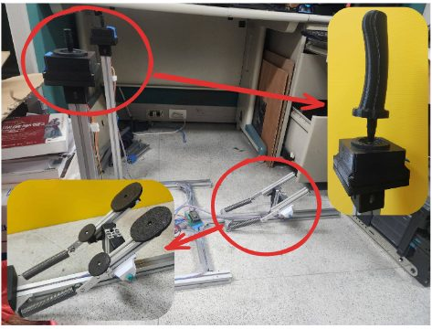
  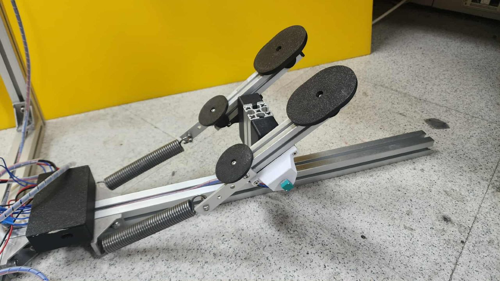
  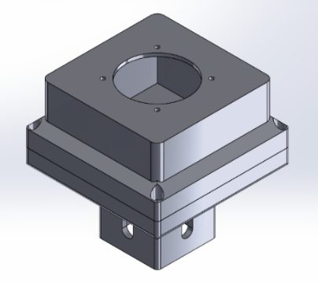

  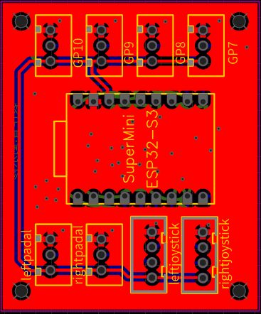
  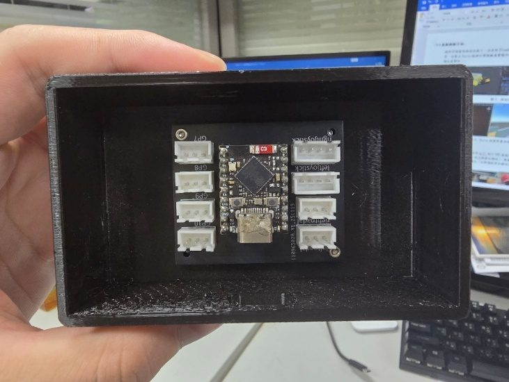
  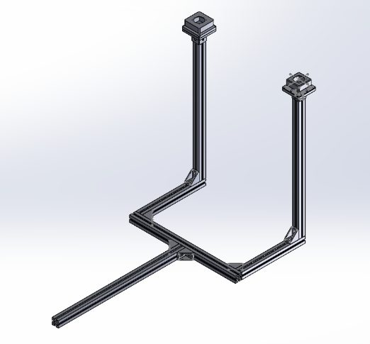

## 🎮 軟體設計

- **3D 建模**：Blender 建立挖掘機模型、SketchUp 依勞動部術科測試參考資料建立 1:1 考場。
- **物理模擬**：Rigidbody 賦予質量、重力與阻力；Collider 判定挖斗與地面接觸；Hinge / Configurable Joint 建立大臂、小臂、挖斗連動與作動限制。
- **即時通訊**：Unity 端以 UDP 接收 ESP32 封包，把搖桿操作即時轉為機具動作。
- **使用者介面**：
  - **Menu**：即時顯示 Wi-Fi 連線狀態，確認軟硬體通訊正常
  - **Select Mode**：三種模擬考場（First / Second / Third test）
  - **測驗畫面**：5 分鐘倒數計時、即時記錄 **違規次數**，可 Reset 重來或返回選單
  - 支援 **VR** 沉浸式操作

  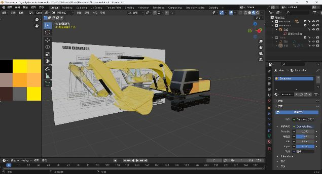
  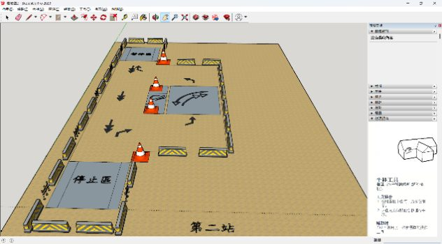

  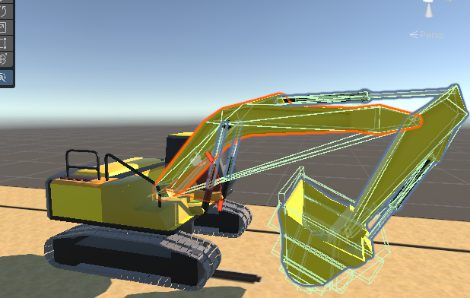
  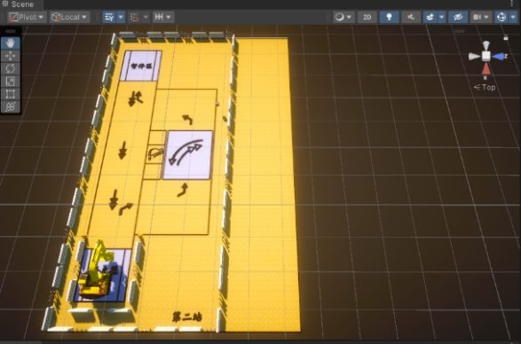

  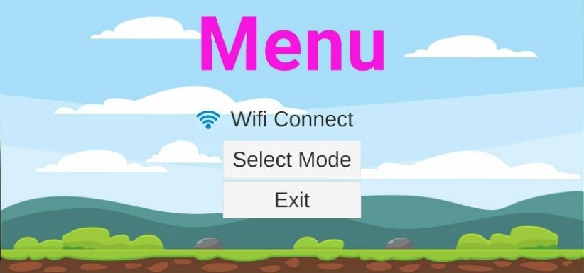
  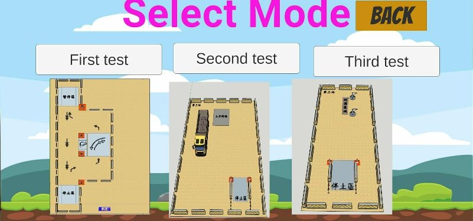
  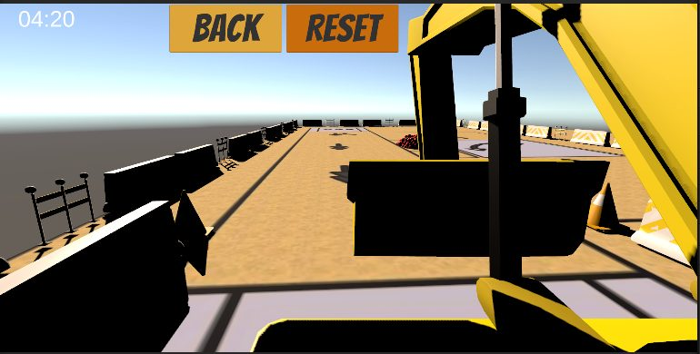

## 🌱 推廣與回饋

作品曾在多個展場讓 **沒有挖掘機駕駛經驗的一般民眾** 與國小學童實際試玩。比賽中也得到評審的改良建議，在教授與學長指導下逐步改良至第二代。

## 🛠️ 技術關鍵字

`Unity` `C#` `ESP32` `Wi-Fi` `UDP` `Blender` `SketchUp` `PCB 設計` `3D 列印` `鋁擠型機構` `VR` `物理引擎`
