# ② 仿生機器魚
**Bionic Robotic Fish for Pond Fishing**

> 國立虎尾科技大學 資訊工程系 · 行動運算與人機介面實驗室　|　2024/02 – 2025/11　|　團隊專題

[← 回到首頁](../../README.md)

<p align="center">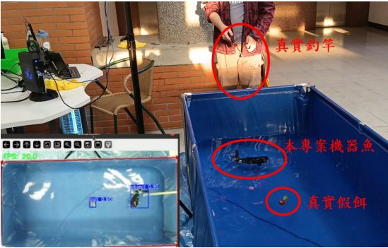</p>

## 🏆 成果

| 成果 | 說明 |
|:---|:---|
| 🏅 第25屆 旺宏金矽獎 半導體設計與應用大賽 | **優勝獎**（應用組，作品：仿生機器魚用於池釣訓練） |
| 🏅 2025 第30屆 大專校院資訊應用服務創新競賽 | 資訊應用組 **佳作**（作品：可以與人互動的仿生機器魚） |

## 🙋 我的負責項目：馬達控制與驅動電路

機器魚尾部使用 **SC09 串口伺服馬達**，它採用 **半雙工非同步串列通訊**，但 **RP2350** 內建 UART 是 RX / TX 分離的全雙工介面，兩者無法直接相接。

我設計了專屬的通訊驅動電路：用 **SN74LVC1G125DBVR** 與 **SN74LVC1G126DBVR** 兩顆三態緩衝器，依方向控制把 TX 與 RX 合併到同一條資料線上，讓 MCU 能直接以 UART 控制半雙工馬達匯流排。

<p align="center">
  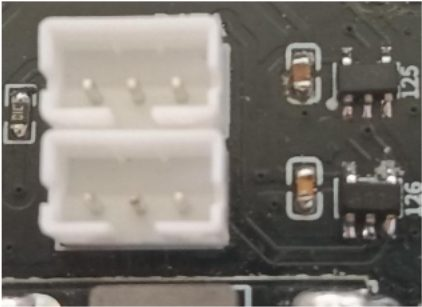
  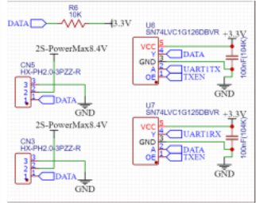
</p>

> 這段經驗後來直接延續到 [③ 餵飯機器人](../03-feeding-robot/) — 同樣是 Feetech 系列的半雙工串口馬達，我從協定層自己實作了整套驅動。

## 🧩 系統架構

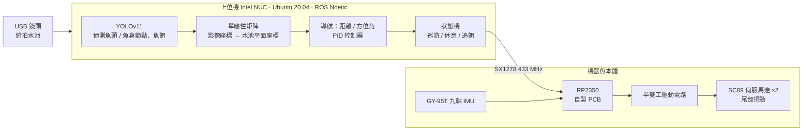

## 🔧 硬體

- **防水尾部機構**：齒輪箱填凡士林、控制板灌低流動性防水膠、液態瞬間膠補縫；尾鰭以 **TPU 95A** 列印提升擺動彈性並降低堵轉風險，假軸使用 **PETG** 列印軸承不易鏽蝕。
- **控制核心**：RP2350 整合於客製 PCB，收納於直徑 60 mm 壓克力防水艙。
- **水下通訊**：捨棄 2.4 GHz，改用穿透性較佳的 **SX1278 433 MHz** 模組。
- **姿態感測**：GY-95T 九軸 IMU（解析度 0.01°）直接輸出歐拉角，減輕 MCU 運算負擔。

<p align="center">
  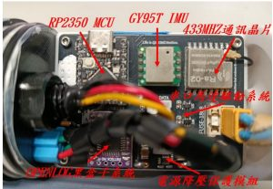
  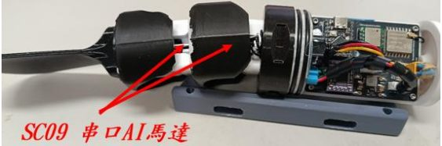
</p>

## 🧠 軟體

**仿生游動模型**　參考 *Swimming of robotic fish based biologically-inspired approach*：

```
Aᵢ(t) = kᵢ · Amᵢ · sin(2πft − θᵢ) + Amᵢ · Δ(t)

Aᵢ(t)：第 i 顆馬達在時間 t 的擺動角度    kᵢ：振幅增益係數    Amᵢ：最大振幅
f：擺動頻率（控制游速）    θᵢ：各節段相位差（形成波浪運動）    Δ(t)：連續相位偏移修正項（轉向）
```

改良為可平滑過渡的連續控制形式，依導航需求動態調整振幅與頻率；並利用串口馬達的位置回饋預測起始擺動位置，消除啟動時的不自然抽動。

<p align="center">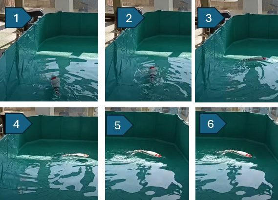</p>

**影像定位**　YOLOv11 以 2,501 張經亮度 / 對比資料增強的訓練集訓練，魚頭與魚身節點偵測 **mAP@50 = 99.5%**；再以水池四角點做單應性透視轉換，把 1920×1080 影像映射到實體平面座標。

<p align="center">
  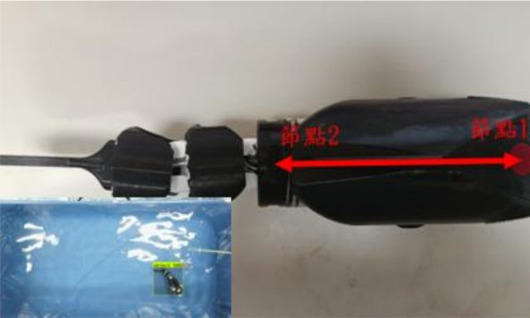
  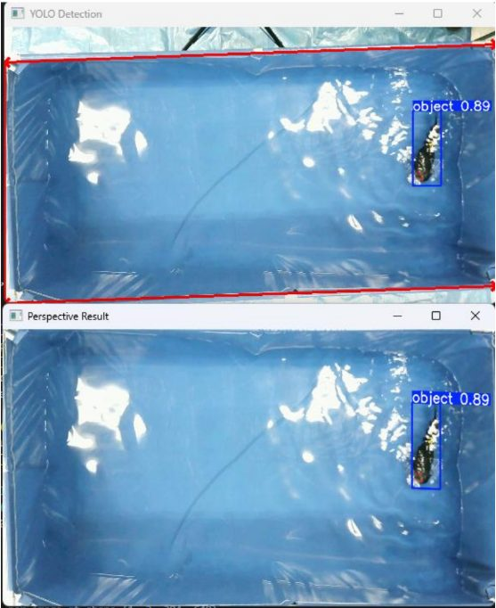
</p>

**導航與行為**　ROS + RViz 視覺化，PID 以距離與方位角修正軌跡；狀態機讓機器魚在兩個目標點間巡游、休息，偵測到魚餌時切換為「追餌」狀態，搭配魔鬼氈安全釣組實現「拋餌 → 追蹤 → 上鉤」。

<p align="center">
  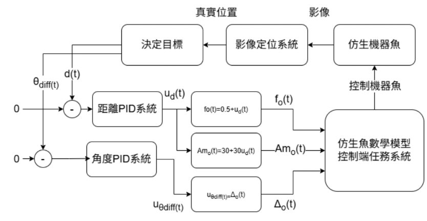
  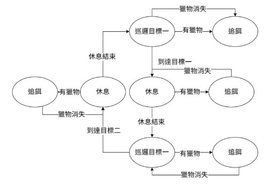
</p>
<p align="center">
  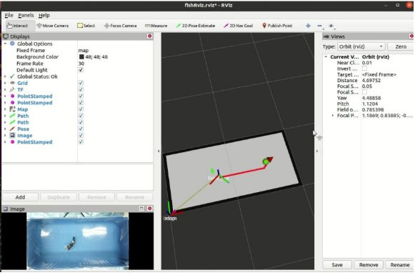
  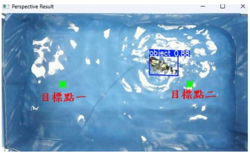
</p>

## 🛠️ 技術關鍵字

`RP2350` `UART 半雙工` `SN74LVC1G125/126` `PCB 設計` `SX1278 433MHz` `GY-95T IMU` `ROS Noetic` `RViz` `YOLOv11` `Homography` `PID` `State Machine` `3D 列印 (TPU / PETG)`
