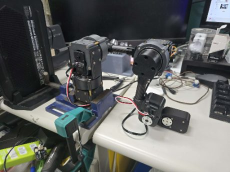
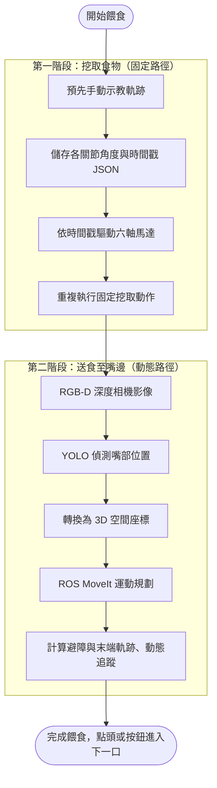
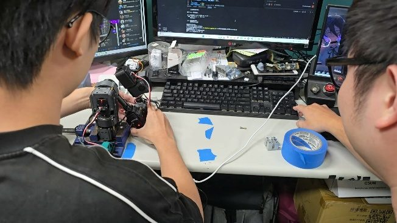
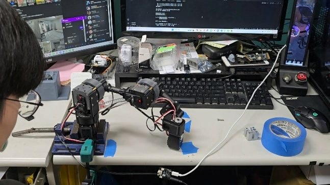
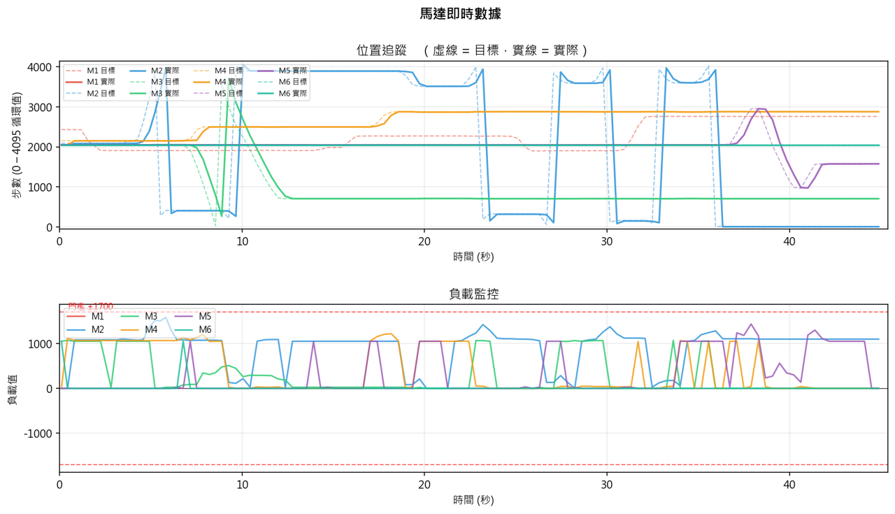
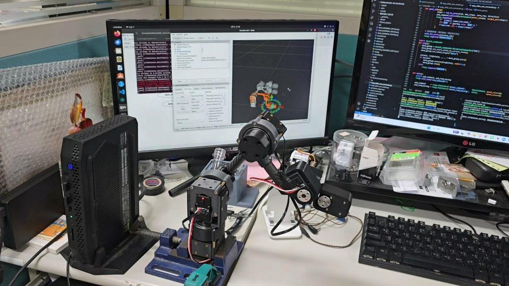

# ③ 餵飯機器人
**Assistive Feeding Robot Arm**

> 國立虎尾科技大學 資訊工程系 · 行動運算與人機介面實驗室　|　2025/11 – 迄今（研發中）

[← 回到首頁](../../README.md)　·　📂 [原始碼 src/](src/)

<p align="center"></p>

## 💡 動機

台灣雙薪家庭比例持續攀升，居家托育（保母）需求大增，但保母通常一人同時照顧 2 – 3 名孩童。**家母長年從事居家托育**，我在日常中看到：每到餵食時段，注意力幾乎全集中在正在吃飯的孩子身上，其他孩子的需求只能暫時擱置。

餵食是照護中 **重複性高、耗時、又需要高度專注** 的環節 — 很適合交給機器輔助，讓照護者能在餵食時段同時照顧其他孩子。

## 🧩 兩階段系統設計

把餵食動作拆成性質不同的兩段，分別用最合適的技術處理：

| 階段 | 特性 | 做法 | 狀態 |
|:---|:---|:---|:---:|
| **① 挖取食物** | 路徑固定、可重複 | **示教錄製 → 時間戳回放** | ✅ 已完成 |
| **② 送到嘴邊** | 使用者頭部位置因人而異且會移動 | **YOLO 嘴部偵測 + RGB-D 深度相機 + ROS MoveIt 動態規劃** | 🚧 ROS / MoveIt 驅動已完成，視覺整合中 |



## 🔧 硬體

**伺服馬達配置** — 6 顆飛特 Feetech **STS3215**，共用一條 RS-485 匯流排，以 ID 1 – 6 定址。

| ID | 關節 | 減速機 | 每圈步數 | 初始位置 |
|:---:|:---:|:---:|:---:|:---:|
| 1 – 3 | 關節 1 – 3（需大扭矩） | 1:3 行星減速機 | **12,258**（機構校正值，理論 4096×3） | 2048（輸出軸約 60°） |
| 4 – 6 | 關節 4 – 6 | 直驅 | 4,096 | 2048（輸出軸 180°） |

**通訊** — RS-485 半雙工，1,000,000 bps，Feetech SCS 協定：

```
[0xFF, 0xFF, ID, LENGTH, INST, ...PARAMS, CHECKSUM]
CHECKSUM = ~(ID + LENGTH + INST + ΣPARAMS) & 0xFF        // little-endian
```

<p align="center"></p>

## 💻 軟體實作（全部自行撰寫，不依賴廠商 SDK）

### A. 序列通訊驅動層 — [`motor.py`](src/motor.py)
以 `pyserial` 從封包層實作 `ping` / `read_word` / `write_word` / `enable_torque` / `set_angle`。`set_angle()` 做角度 ↔ 步數換算並把輸入限制在 0° – 360°，避免溢位造成馬達異常旋轉。每次送封包前清空輸入緩衝區，避免半雙工下讀到殘留資料。

### B. 示教錄製 — [`recorder.py`](src/recorder.py)
關閉扭矩後用手帶著手臂走一次完整動作，以約 **125 Hz** 輪詢六軸位置並存成 JSON。

**難點：減速機關節的多圈追蹤。** STS3215 的 `PRESENT_POSITION` 只回傳 0 – 4095，但 1:3 減速後輸出軸轉一圈馬達要轉三圈。我寫了 `RevolutionTracker`，以相鄰兩幀的差值偵測跨圈：

```python
delta = raw - last
if delta < -WRAP_THRESHOLD:    # 3900 → 100：正向跨圈
    self._revs[motor_id] += 1
elif delta > WRAP_THRESHOLD:   # 100 → 3900：反向跨圈
    self._revs[motor_id] -= 1
return self._revs[motor_id] * 4096 + raw   # 連續的絕對步數
```

### C. 動作回放與安全保護 — [`player.py`](src/player.py) · [`visualizer.py`](src/visualizer.py)
- 依錄製時間戳計算每幀送出時機，支援播放速度比例調整
- 一次寫入 `ACC + GOAL_POSITION + GOAL_TIME + GOAL_SPEED`，讓馬達在幀間連續移動不停頓；負值目標以 bit 15 符號位編碼
- 每 N 幀一次讀取 **位置 + 速度 + 負載**（6 bytes），**負載超過門檻立刻切斷全部扭矩並發出警報** — 硬體層級的安全保護（手臂會靠近人臉，這是必要的）
- 終端機 ANSI 即時儀表板 + matplotlib 即時繪圖（目標 vs. 實際、負載監控），結束後存成圖表
- 播放前後自動回歸初始位置，確保每次操作一致

<p align="center">
  
  
</p>
<p align="center"></p>
<p align="center"><sub>回放時的即時數據：上 — 各軸目標（虛線）vs. 實際（實線）位置；下 — 負載與警戒門檻</sub></p>

### D. ROS / MoveIt 整合 — [`ros/`](src/ros/)
| 節點 | 功能 |
|:---|:---|
| [`sts3215_joint_state_reader.py`](src/ros/sts3215_joint_state_reader.py) | 被動模式：扭矩關閉，讀取各軸位置轉為弧度發布 `/joint_states`，手動擺動實體手臂、RViz 同步顯示 |
| [`sts3215_moveit_driver.py`](src/ros/sts3215_moveit_driver.py) | 主動模式：訂閱 `/execute_trajectory/goal`，在背景執行緒依 MoveIt 規劃的路徑點驅動實體手臂，同時持續回報 `/joint_states`；含多圈追蹤與序列埠鎖 |

<p align="center"></p>

## ▶️ 執行方式

```bash
pip install -r src/requirements.txt

python src/read_pos.py                 # 讀取單顆馬達原始步數（校正用）
python src/recorder.py                 # 示教錄製，輸出 recording_YYYYMMDD_HHMMSS.json
python src/player.py <recording.json>  # 回放錄製動作（含負載保護與即時圖表）
python src/visualizer.py               # 對既有錄製檔事後繪圖
```

> 預設序列埠為 `COM23`，請依實際環境修改各檔案開頭的 `PORT`。[`src/data/`](src/data/) 附一份實際錄製的範例資料。

## 🚧 下一步

- [ ] 整合 YOLO 嘴部偵測與 RGB-D 深度相機，取得 3D 目標點
- [ ] 第一、二階段串接成完整餵食流程
- [ ] 點頭（影像辨識）或按鈕觸發下一口
- [ ] 將 `set_angle()` 擴充為依關節區分減速 / 直驅版本，並改為事件驅動的封包接收

## 🛠️ 技術關鍵字

`Python` `pyserial` `RS-485` `Feetech SCS Protocol` `STS3215` `ROS` `MoveIt` `RViz` `YOLO` `RGB-D` `matplotlib` `Multithreading`
